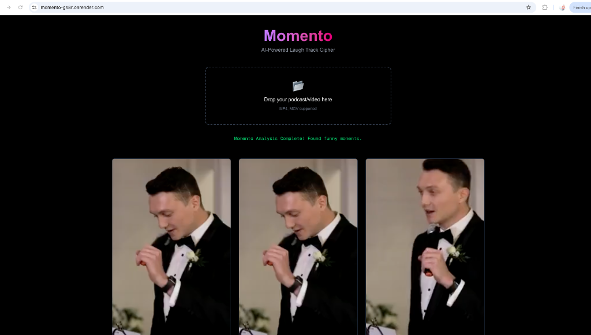

# Momento - AI Powered Laugh Track Cipher 🎭

Momento is an intelligent video processing application that automatically detects funny moments in your videos and slices them into shareable "shorts". It uses **ElevenLabs Scribe v2** for high-accuracy transcription and laughter detection, and **FFmpeg** for precise video editing.



## 🚀 Live Demo
**[Live on Render](https://momento-gs8r.onrender.com)**

> **⚠️ IMPORTANT PERFORMANCE NOTE:**
> This demo is currently deployed on a **Render Free Tier** instance.
> - **Memory:** 512 MB
> - **CPU:** 0.1 vCPU
>
> Due to these resource constraints, **processing a video can take up to 10 minutes**. Please be patient!
> For the best experience, we recommend testing with the provided **30-second sample video**.

## ✨ Features
- **Auto-Laughter Detection**: Uses AI to pinpoint exactly when people are laughing.
- **Smart Slicing**: Automatically cuts the video to include the setup (45s before) and the punchline (2s after).
- **Privacy First**: Files are processed in ephemeral storage and are not permanently saved.
- **Modern UI**: Clean, responsive interface built with Tailwind CSS.

## 🛠️ Tech Stack
- **Frontend**: Next.js 15, React 19, Tailwind CSS
- **Backend API**: Next.js Server Routes
- **AI Processing**: ElevenLabs Scribe v2 API
- **Video Processing**: FFmpeg (running on Docker)
- **Deployment**: Render (Dockerized)

## 📂 Sample Data
To test the application easily, we have provided a sample funny clip.
- **File:** `public/funny.mp4`
- You can find this file in the repository or download it to test the upload functionality.

## ⚡ Getting Started Locally

1. **Clone the repository**
   ```bash
   git clone https://github.com/developers-everyday/momento.git
   cd momento
   ```

2. **Install dependencies**
   ```bash
   npm install
   ```

3. **Set up Environment Variables**
   Create a `.env.local` file in the root directory:
   ```env
   ELEVENLABS_API_KEY=your_api_key_here
   ```

4. **Run the development server**
   ```bash
   npm run dev
   ```

5. **Open your browser**
   Navigate to [http://localhost:3000](http://localhost:3000).

## 🐳 Docker Support
This project is fully containerized to ensure FFmpeg compatibility across all platforms.
```bash
# Build
docker build -t momento .

# Run
docker run -p 3000:3000 --env-file .env.local momento
```
